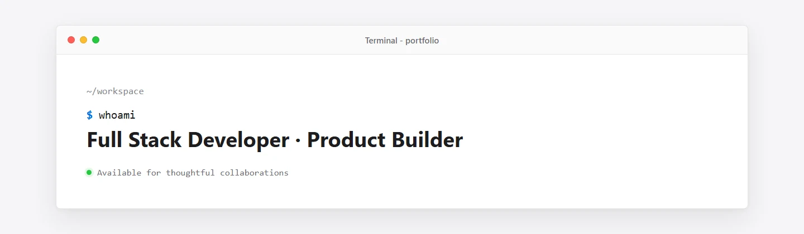

# ProsperousEnding

把想法做成稳定、清晰、真正好用的产品。

`China` · `UTC+8` · `Open to collaboration`

[About](#about) ·
[Toolkit](#toolkit) ·
[技术博客](https://www.cnblogs.com/ProsperousEnding) ·
[邮件联系](mailto:prosperousending@gmail.com)

## About

我是一名全栈开发者，关注可维护的系统架构与自然、克制的用户体验。喜欢从真实需求出发，把产品设计、工程实现和长期维护放在一起考虑。

除了产品开发，也会通过博客记录技术实践，整理值得长期使用的工具与资源。代码之外，我喜欢游戏王策略卡牌、音乐和技术写作。

## Focus

1. 构建内容丰富、响应式且便于长期维护的 Web 应用
2. 改进数据质量、搜索与推荐体验，以及多端性能
3. 完善自动化测试、持续集成和静态部署流程
4. 探索 AI 辅助开发、云原生应用和自然的产品交互

## Toolkit

| Layer   | Stack                                               |
| ------- | --------------------------------------------------- |
| Client  | Vue 3, JavaScript, TypeScript, Vite, Node.js        |
| Server  | Java, Spring Boot, C#, .NET                         |
| Data    | MySQL, PostgreSQL, MongoDB, Redis, InfluxDB         |
| Quality | GitHub Actions, Docker, Vitest, Playwright          |
| Design  | Responsive UI, Figma, Adobe Creative Suite, Blender |

## Principles

- 从实际使用场景出发，先解决核心问题，再扩展功能
- 用清晰的配置、测试和文档降低后续维护成本
- 关注响应式布局、可访问性、性能和异常状态

## Activity

  

## Contact

欢迎交流产品、工程实践或合作想法：

[GitHub](https://github.com/ProsperousEnding) ·
[博客园](https://www.cnblogs.com/ProsperousEnding) ·
[prosperousending@gmail.com](mailto:prosperousending@gmail.com)

Designed and built with care.

